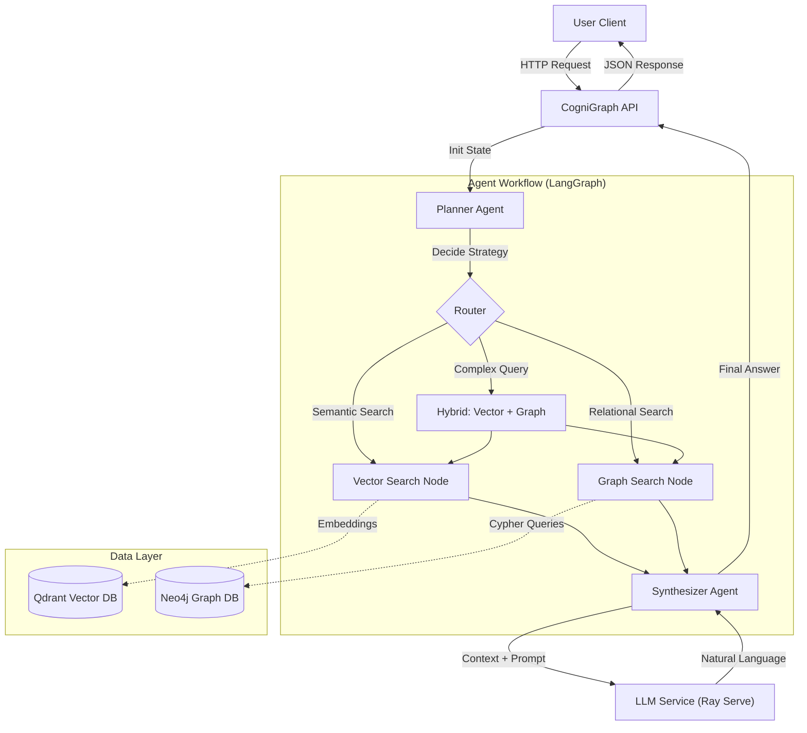

# CogniGraph: Enterprise GraphRAG System

[](https://github.com/abujumaa/Cognigraph)
[](https://www.python.org/)
[](https://www.docker.com/)

**CogniGraph** is an enterprise-grade **GraphRAG (Retrieval-Augmented Generation)** system designed for complex information retrieval tasks. By combining the semantic understanding of **Vector Databases** (Qdrant) with the relational reasoning capabilities of **Graph Databases** (Neo4j), CogniGraph delivers superior answers to multi-hop and context-heavy queries.

The system is orchestrated using **LangGraph**, employing a multi-agent architecture to plan, route, and synthesize information dynamically.

## Disclaimer
**Note:** This project has been extensively validated with the assistance of Artificial Intelligence tools to ensure robustness, reliability, and edge-case coverage.


## System Architecture

CogniGraph employs a modular, multi-agent architecture. The **Planner** agent analyzes the user's intent to decide whether to use semantic search, graph traversal, or a hybrid approach.



### Request Flow (Sequence)


## Features

*   **Hybrid Search**: Seamlessly blends vector similarity with graph traversal.
*   **Adaptive Planning**: An LLM-based planner decides the best retrieval strategy for each query.
*   **Enterprise Ready**:
    *   **Neo4j** for knowledge graph management.
    *   **Qdrant** for high-performance vector search.
    *   **Ray Serve** for scalable LLM inference.
*   **Secure**: API Key authentication and header-based security.
*   **Observability**: Detailed logging for debugging and audit trails.


## Directory Structure

```text
cognigraph/
├── config/                 # Configuration files
├── docker-compose.yml      # Infrastructure definition
├── src/
│   ├── agents/             # LangGraph Agents (Planner, Searchers, Synthesizer)
│   ├── api/                # FastAPI Application
│   ├── ingestion/          # Data Pipeline (ETL -> Neo4j & Qdrant)
│   ├── llm/                # Interfaces for LLM providers
│   └── utils/              # Logging and helpers
├── tests/                  # Pytest suite
└── deploy.sh               # Deployment automation script
```


## Getting Started

### Prerequisites

*   **Docker & Docker Compose**: Essential for running the databases and services.
*   **Python 3.9+**: For local development and testing.
*   **Git**: Version control.

### 1. Installation

Clone the repository:
```bash
git clone https://github.com/USERNAME/cognigraph.git
cd cognigraph
```

Create a virtual environment:
```bash
python3 -m venv venv
source venv/bin/activate
pip install -r requirements.txt
```

### 2. Configuration

Copy the example environment file:
```bash
cp .env.example .env
```

Edit `.env` to set your specific configurations (API keys, database passwords, etc.).

| Variable | Description | Default |
| :--- | :--- | :--- |
| `GRAPH_RAG_API_KEY` | Secret key for API access | `secret-enterprise-key` |
| `NEO4J_URI` | Neo4j Bolt URI | `bolt://localhost:7687` |
| `QDRANT_URL` | Qdrant REST URL | `http://localhost:6333` |

### 3. Running the System

Start the infrastructure using Docker Compose:

```bash
docker-compose up -d
```

This will spin up:
*   **Neo4j**: `http://localhost:7474`
*   **Qdrant**: `http://localhost:6333/dashboard`
*   **Ray Serve**: `http://localhost:8000`
*   **CogniGraph API**: `http://localhost:8080`

To verify everything is running:
```bash
curl http://localhost:8080/health
# {"status": "healthy"}
```


## Usage Guide

### Ingesting Data

Before querying, populate the system with data. The ingestion pipeline mocks fetching documents (e.g., from S3), chunking them, and loading them into both databases.

```bash
# Run ingestion script
PYTHONPATH=. python src/ingestion/pipeline.py
```

### Querying the API

You can query the system via HTTP POST requests. The system will automatically route the query.

#### Example: Hybrid Query
```bash
curl -X POST http://localhost:8080/query \
  -H "Content-Type: application/json" \
  -H "X-API-Key: secret-enterprise-key" \
  -d '{
    "query": "What are the risks associated with the vendors mentioned in the Q3 audit?"
  }'
```

**Response:**
```json
{
  "answer": "The Q3 audit report identifies Vendor X as high risk due to compliance failures...",
  "execution_plan": "hybrid"
}
```


## Testing

Run the test suite to verify the logic:

```bash
# Install test dependencies
pip install pytest

# Run tests
PYTHONPATH=. pytest tests
```


## Contributing

1.  Fork the repository.
2.  Create a feature branch (`git checkout -b feature/amazing-feature`).
3.  Commit your changes (`git commit -m 'Add some amazing feature'`).
4.  Push to the branch (`git push origin feature/amazing-feature`).
5.  Open a Pull Request.


## License

Distributed under the MIT License. See `LICENSE` for more information.
